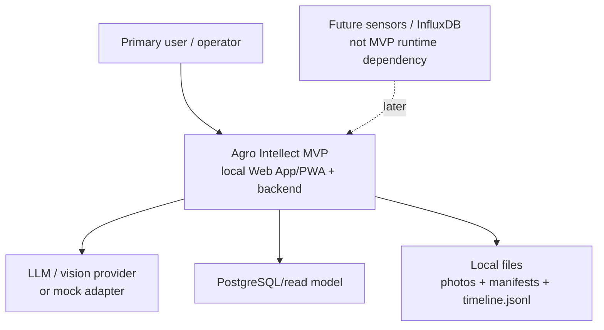
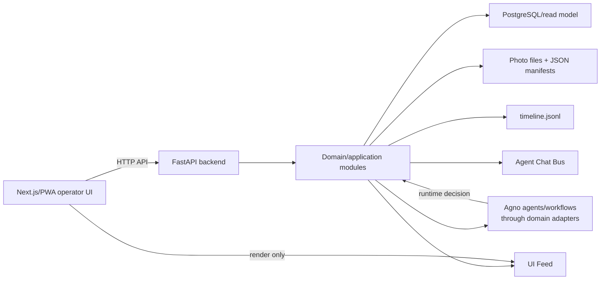
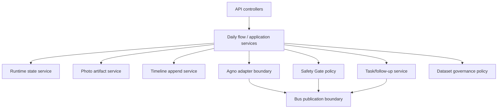
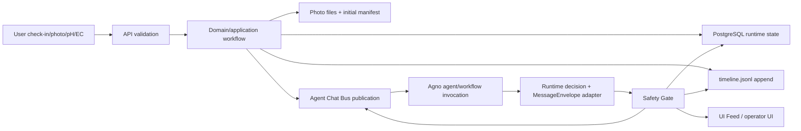
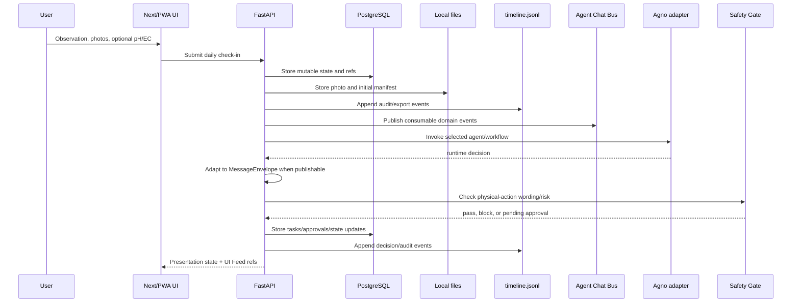

# System Architecture

## Scope

This spec defines the global MVP backbone after `/prd` and before feature-local `/spec-improve FT-<NNN>`.

The MVP is a local-first modular monolith for one hydroponic tomato, `tomato_001`. It combines a FastAPI backend, a React/Next.js/PWA operator surface, PostgreSQL runtime state, local photo files/manifests, append-only `timeline.jsonl`, domain-owned Agent Chat Bus, UI Feed presentation, and Agno execution SDK inside one deployable local system.

## Architecture Decisions

- Use a layered modular monolith for the MVP. Do not split into microservices or production SaaS components.
- Backend is Python/FastAPI and owns HTTP API, domain workflows, persistence adapters, file artifact handling, timeline append, agent adapters, Safety Gate orchestration, and OpenAPI generation.
- Frontend is React/Next.js/PWA and owns the local operator UI only: check-in, photo upload, pH/EC input, plant card, tasks, history, recommendations, approval prompts, and controlled spoiler notes.
- PostgreSQL/read model is runtime authority for mutable operational state.
- Local file storage owns photo binaries and immutable JSON manifest/export artifacts.
- `timeline.jsonl` is append-only audit/export, not mutable state.
- Agent Chat Bus is the domain working event stream for agent-consumable events.
- UI Feed is presentation only and is not passed to agents as working context.
- Agno is an execution SDK for agents/workflows inside the monolith. Agno invocation is not Agent Chat Bus publication.
- InfluxDB/time-series storage is future-only and must not be a runtime dependency before real sensors exist.

## C4 Context



## Container View



## Component View



## Source Of Truth / Authority Model

This section defines what may be treated as authoritative in the MVP and what must remain transport, presentation, export, or execution detail.

### Authority Hierarchy

| Layer | Authority | Owns | Does not own |
|---|---|---|---|
| Governance | [.memory-bank/constitution.md](../constitution.md) | Non-negotiable project rules | Feature-local implementation details |
| Product/spec | PRD, requirements, SDD specs routed by [.memory-bank/spec-index.md](../spec-index.md) | Product scope, contracts, lifecycle rules | Runtime mutable state |
| Runtime state | PostgreSQL/read model | Current mutable operational state | Photo binaries, immutable export snapshots |
| Audit/export | `timeline.jsonl` | Append-only trace of events | Primary mutable state |
| Photo artifacts | Local files and JSON manifests | Photo binaries, initial capture manifests, export snapshots | Current review/dataset/sync status |
| Agent context | Agent Chat Bus | Agent-consumable working domain events | Durable mutable state or UI presentation |
| UI presentation | UI Feed | Human-visible presentation events and controlled spoiler notes | Agent working context |
| Agent execution | Agno Agent/Workflow/Team | Runtime invocation and tool/model orchestration | Domain source of truth or Bus publication authority |
| Human gate | Human approval/review records | Explicit approval/rejection and manual review decisions | Automated device execution |
| Future sensors | InfluxDB/time-series store after sensors exist | Sensor readings/time windows | MVP runtime dependency before sensors |

### Runtime Rules

- PostgreSQL/read model is the only MVP authority for mutable plant state, photo catalog status, tasks, approvals, human review, dataset fields, `can_train_on`, event refs, sync status, and future `sensor_window_ref`.
- `timeline.jsonl` must be append-only. It may be used for audit, import/export, debugging, and evidence trails, but not as the primary source for current state.
- Photo JSON manifests are immutable artifact snapshots. They must not be read as the current source for mutable review, dataset, sync, or plant state.
- Agent Chat Bus events may influence downstream agents, but they become durable state only through explicit domain/application state transitions.
- UI Feed events and spoiler notes must not become agent input, facts, labels, or training data.
- Agno memory, storage, workflow state, workflow events, Team synthesis, and raw step output are not domain facts.

### Conflict Handling

- If PostgreSQL/read model conflicts with a photo manifest, PostgreSQL wins for current mutable state.
- If PostgreSQL/read model conflicts with `timeline.jsonl`, treat it as a data integrity issue and investigate through event refs; do not silently repair from timeline.
- If agent output conflicts with human review or follow-up evidence, keep the agent output as hypothesis and preserve the conflict status.
- If Safety Gate is unavailable or cannot classify physical-action wording, fail closed.

### Sync Boundary

- MVP sync status is `local_only`.
- A 200 MB local storage prompt is UI guidance only and must not imply server availability or mutate sync authority.
- `server_verified` is forbidden until a real server sync stage exists.

## Module Boundaries

This section keeps the MVP small while preventing authority, safety, agent, and UI concerns from bleeding into each other.

### Backend Modules

| Module | Owns | May depend on | Must not do |
|---|---|---|---|
| API layer | FastAPI routes, request/response validation, generated OpenAPI | Application services, auth/CORS/upload guards | Encode domain authority decisions directly in controllers |
| Application workflows | Daily flow orchestration, use-case transactions | Domain policies, persistence ports, artifact services, agent adapters | Bypass Safety Gate or publish raw Agno output |
| Domain policies | Safety, freshness, dataset trainability, state confidence, task transitions | Pure data structures and time/source refs | Perform IO or call external models |
| Persistence adapters | PostgreSQL reads/writes for mutable state | Database driver/migrations | Store photo binaries or use JSON manifests as current state |
| Artifact adapters | Photo file storage, `sha256`, manifest writes, path safety | Filesystem and upload validation | Treat manifests as mutable state authority |
| Event/audit adapters | `timeline.jsonl` append-only writes | Domain events and identifiers | Use timeline as primary mutable state |
| Agent adapters | Agno invocation, runtime decision adaptation, model/provider metadata | Domain contracts, Agno SDK, LLM/vision provider | Publish to Bus without `MessageEnvelope` and publication boundary |
| Bus publication | `BusEventEnvelope`, event type validation, `consumable_by_agents` | Domain events and message envelopes | Accept UI Feed or raw reasoning as Bus content |
| UI Feed publication | Presentation events and spoiler-note refs | Domain state and display-safe summaries | Feed agents or create domain facts |

### Frontend Modules

| Module | Owns | Must respect |
|---|---|---|
| Daily operator surface | Check-in, photo upload, pH/EC input, plant card, task/history views | API contracts, Safety Gate display outcomes |
| Approval surface | Human approval/rejection prompts and decision capture | Approval unlocks only human-performed task tracking |
| UI Feed renderer | Controlled spoiler notes, statuses, debug-lite cards | `visible_to_agents=false` and no raw chain-of-thought |
| Local sync prompt | 200 MB prompt display | `sync.status` remains `local_only` in MVP |

### Dependency Rules

- Application workflows coordinate modules; lower-level adapters do not call workflows.
- Domain policies must stay pure enough for unit/policy tests.
- Agents communicate through Agent Chat Bus and runtime decisions; agents do not directly command each other.
- UI Feed is a sink for presentation, not a source for agent context.
- Safety Gate is checked before any user-visible physical-action wording is displayed or converted to a task.
- Feature-local specs may refine module names and schemas, but must not invert these boundaries without a new architecture decision.

## Agno Boundary

Agno is an execution SDK inside the modular monolith. It can run agents, workflows, tools, HITL steps, guardrails, memory, knowledge, and storage, but it is not the domain source of truth and not the Agent Chat Bus.

### Mandatory Boundary

```text
Agno invocation != Agent Chat Bus publication
```

An Agno Agent/Workflow/Team result becomes domain-consumable only after the project-owned adapter:

1. Receives execution output.
2. Produces exactly one runtime decision: `speak`, `silent`, `clarify`, or `escalate`.
3. Validates or creates a `MessageEnvelope` when the decision is publishable.
4. Applies concise-output and source-ref rules.
5. Routes physical-action wording through Safety Gate before user-visible display or action-task creation.
6. Publishes to Agent Chat Bus only through `BusEventEnvelope`.
7. Writes required audit evidence.

### Allowed Agno Use

- Agno Agent and Agno Workflow are allowed as default MVP execution tools.
- Agno Team is optional and must not be required for the MVP.
- If Agno Team is configured, `coordinate` mode is forbidden.
- Allowed Team modes, when justified by a feature spec, are `route`, `broadcast`, or `tasks` with bounded iterations and the same domain adapter on output.

### Non-authoritative Agno Data

The following are execution artifacts, not domain facts:

- workflow events;
- step output;
- Team synthesis;
- Agno memory/storage;
- tool traces;
- raw model reasoning;
- provider-specific message history.

## Primary Data Flow



Domain/application workflows publish separately to `timeline.jsonl` and Agent Chat Bus. Timeline events may be referenced by Bus payloads as `source_ref` evidence, but timeline import/replay is not Bus publication authority and agent context builders must read validated Bus events, not timeline events directly.

## Daily Check-in Sequence



## Test Requirements

- Adapter tests must prove raw Agno output cannot enter Agent Chat Bus.
- `silent` must create no `MessageEnvelope` and no Bus event, while leaving audit evidence.
- Any Team configuration must be checked so `coordinate` mode is not used.
- Workflow events such as `step_completed` must not be treated as domain facts.

## Downstream Requirements

- Feature-local `/spec-improve` must define endpoint shapes, schemas, table/migration details, file naming, and UI behavior before task decomposition.
- T2/T3 task records must link the relevant authoritative backbone specs from [.memory-bank/spec-index.md](../spec-index.md).
- Any design that changes physical plant state must route through Safety Gate and human approval before becoming an actionable human task.
