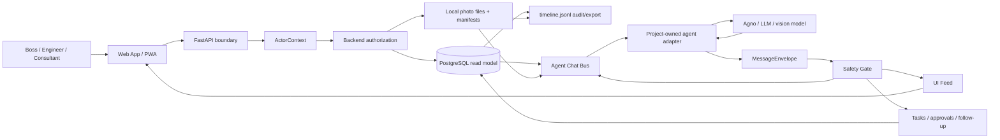

# System Architecture

## System Goal

Agro Intellect MVP v2 is a local-first Farm workspace and Web App/PWA for safe, traceable Plant operations with AI-assisted workflows. The architecture must keep authority, safety, access, agent context, UI presentation, audit/export, and future dataset governance separated enough that implementation agents cannot accidentally turn presentation, raw model output, or governance discussion into runtime truth.

## Main Constraints

- Local modular monolith, not microservices.
- One local Farm workspace in MVP.
- Local Accounts, FarmMembership, role presets, PlantAccessGrant, and ActorContext gate every Farm/Plant route and context builder.
- PostgreSQL/read model is mutable runtime authority unless a later active architecture spec replaces it.
- Local photo files and manifests are artifacts, not mutable runtime authority.
- `timeline.jsonl` is append-only audit/export, not mutable runtime authority.
- Agent output must pass project-owned runtime decision, MessageEnvelope, Agent Chat Bus, and UI Feed boundaries.
- UI Feed, raw chat, raw model reasoning, admin notices, and unapproved Companion proposals never become agent working context.
- Safety Gate and authorized human approval are required before physical-action wording can become a human-performed action task.
- MVP data remains local/private by default with `local_only` sync status.

## Non-Goals

- Production SaaS, hosted sync, billing, enterprise identity, or multi-Farm tenancy.
- Automated device execution, dosing, pump, pH/EC correction, light-control, autowatering, or autodosing.
- Agno as source of truth, domain coordinator, Agent Chat Bus replacement, or storage authority.
- Full dataset registry, real fine-tuning, sensor runtime dependency, or complex RAG in MVP.
- Hand-written OpenAPI as primary design source before backend schemas exist.

## Architecture Style

Use a local modular monolith:

- Backend: Python/FastAPI with Pydantic-style schema validation.
- Frontend: role-aware Web App/PWA.
- Runtime state: PostgreSQL/read model.
- Local artifacts: filesystem photo originals/derived files and manifests.
- Audit/export: append-only JSONL timeline.
- Agent execution: Agno/model providers behind project-owned adapters.

The monolith is split by bounded modules inside one deployable system. Module boundaries are authority boundaries, not separate services.

## Source Of Truth

Design-time precedence:

1. Project Constitution and explicit user decisions.
2. Existing production code and mapped brownfield baseline when code exists.
3. ADRs.
4. Authoritative contracts/specs.
5. PRD, requirements, epics, and features.
6. User scenarios and pre-PRD hints.
7. Task records.
8. Agent assumptions.

Runtime authority:

- PostgreSQL/read model owns mutable operational state.
- Local photo files and manifests own file/artifact identity only.
- `timeline.jsonl` owns append-only audit/export trace only.
- Agent Chat Bus owns agent-consumable working events only.
- UI Feed owns human presentation only.
- DecisionRecord owns governance/workflow direction only.
- Safety Gate approval owns physical-action clearance only after fresh evidence and authorized human approval.

## Main Modules / Bounded Contexts

| Module | Owns | Must not own |
|---|---|---|
| Access & Admin | Account, Farm, FarmMembership, sessions, role presets, PlantAccessGrant, ActorContext, AdminAuditRecord. | Plant evidence semantics, agent conclusions, physical-action approval policy. |
| Plant Operations | Daily check-in, observations, manual pH/EC, Plant selection, Plant card/history entry points. | Photo binary authority, model reasoning, Safety Gate bypass. |
| Photo & Artifact Intake | Local photo files, accepted photo catalog metadata, sha256, capture manifests, artifact refs. | Mutable Plant state, agent facts, trainability decisions. |
| Runtime State & Audit | PostgreSQL/read model, timeline audit/export refs, retained Plant history. | UI presentation, raw model output, physical actuation. |
| Agent Runtime | Model invocation adapters, runtime decision, MessageEnvelope preparation. | Domain source of truth, direct DB mutation of Plant facts, UI Feed context. |
| Agent Chat Bus & UI Feed | Bus working events and UI presentation projections. | Raw provider history, hidden reasoning, unauthorized context, Safety Gate approval. |
| Safety & Task Loop | Safety Gate routing, physical-action approval authority, human-performed action tasks, follow-up outcomes. | Automated device execution, governance approval semantics. |
| Companion Governance | IssueStack, HumanAttentionNeeded, CompanionProposal, CompanionConclusion, DecisionRecord, approved governance summary. | Plant-state confirmation, Safety Gate approval, action_task creation by itself. |
| Dataset Governance | Dataset fields, evidence refs, trainability default false, future trainability gates. | Full dataset registry, model fine-tuning, UI Feed-derived trainability. |
| Operator PWA | Role-aware UI, Plant selector, admin and operations surfaces, cards/prompts/history. | Backend authorization, runtime authority, agent working context. |

## Data Flow

## External Integrations

- LLM provider and vision-capable model integrations are external execution dependencies behind adapters.
- Agno is an execution SDK only.
- No real sensors are required in MVP.
- No hosted sync/server upload is required in MVP.

## Storage Decisions

- PostgreSQL/read model stores mutable operational records, access/admin records, task/approval/outcome records, governance records, dataset fields, and photo catalog metadata.
- Filesystem stores local photo binaries and adjacent manifests.
- JSONL timeline stores append-only audit/export events and refs.
- Secrets/auth material are never persisted into logs, timeline, manifests, Bus, UI Feed, screenshots, exports, or agent context.

Detailed table/field layouts belong to [.memory-bank/domains/runtime-data-model.md](../domains/runtime-data-model.md) and feature-level `/spec-improve`.

## API / Contract Boundaries

- HTTP API is FastAPI/Pydantic-style JSON plus multipart upload where needed.
- Every non-health route resolves ActorContext before business logic.
- API errors use stable machine-readable codes and redacted messages.
- Generated OpenAPI may come from backend schemas later; no hand-written OpenAPI is the global source of truth at this stage.
- Agent Chat Bus and MessageEnvelope are separate contracts from HTTP API and UI Feed.

Global contract docs:

- [.memory-bank/contracts/api-guidelines.md](../contracts/api-guidelines.md)
- [.memory-bank/contracts/agent-chat-bus.md](../contracts/agent-chat-bus.md)
- [.memory-bank/contracts/message-envelope.md](../contracts/message-envelope.md)

## Security / Safety Constraints

- Default exposure is loopback.
- LAN mode, if implemented, must be explicit and protected by authentication, authorization, session/token protection, and CORS/origin controls.
- Backend authorization is mandatory for every Farm/Plant route and context builder.
- Frontend hide/show is presentation only.
- Physical-action advice fails closed unless fresh evidence, Safety Gate pass, authorized human approval, and task/action tracking exist.
- Human approval unlocks only human-performed task tracking, never automated execution.
- Companion governance approval is not Safety Gate approval.

## Testing Strategy

Use risk-based testing:

- Unit tests for permissions, state policies, safety gates, trainability, redaction, and context filters.
- Integration tests for ActorContext propagation, photo artifacts, runtime authority vs timeline, real model adapter boundaries, Bus/UI Feed separation, and Companion DecisionRecord semantics.
- E2E tests for Boss setup, Engineer daily workflow, Safety Gate approval, follow-up, Companion governance, unauthorized access, archive/restore, and storage prompt.
- Anti-cheat tests prove runtime/demo agents are not fake/stubbed and UI Feed/raw chat never enter agent context.

The testing router is [.memory-bank/testing/index.md](../testing/index.md).

## Deployment Assumptions

- First demo runs locally on loopback.
- Single local backend and frontend are acceptable.
- PostgreSQL and local filesystem are local dependencies.
- LAN mode is optional and not required for first demo.
- No production SaaS deployment, hosted recovery, server sync, or billing infrastructure in MVP.

## Risks

- Authz implemented only in UI would break the architecture.
- Governance approval could be confused with Safety Gate approval.
- Raw agent/model output could bypass project-owned adapters.
- UI Feed or unapproved proposal content could leak into agent context.
- Real model-backed agent requirement adds integration risk.
- Accounts/Farm/Admin scope could expand into broad farm management.

## Open Questions

No global blocker remains for `/spec-improve`.

Feature-local specs must still define exact auth/session lifecycle, route schemas, DB migrations, event payloads, MessageEnvelope fields, Bus/UI projections, photo storage layout, state machines, freshness windows, action taxonomy, provider configuration, and UI route/view details before task decomposition.
