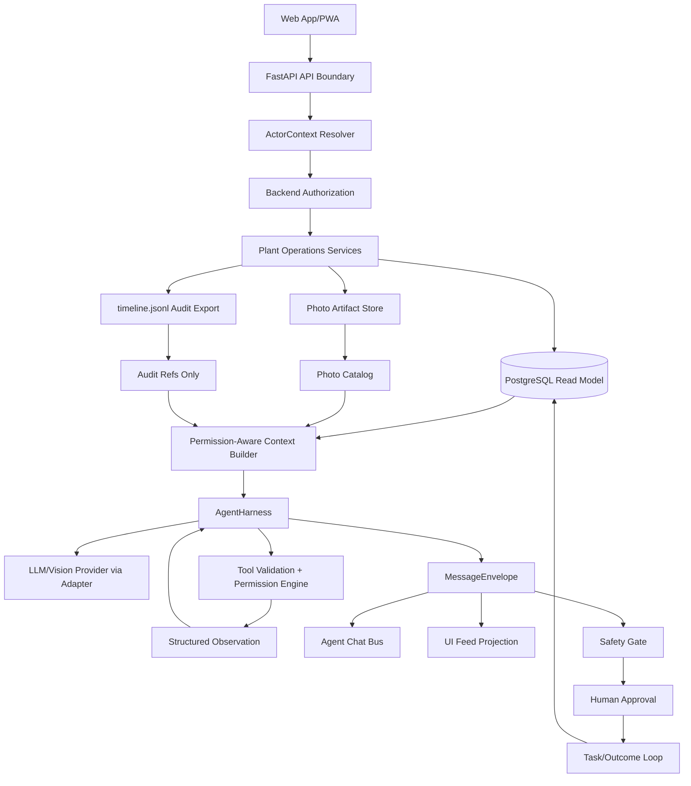

# System Architecture

## System Goal

Agro Intellect MVP v2 is a local-first Farm workspace for safe, traceable,
agent-assisted Plant operations. The first runtime supports one local Farm, local
Accounts, Boss/Engineer/Consultant role presets, multiple Plants, and `tomato_001` as
the initial Plant.

The architecture must keep implementation small while making authority boundaries
mechanically enforceable: backend authorization, mutable runtime state, audit/export,
agent context, UI presentation, governance decisions, Safety Gate approval, and dataset
trainability are separate concerns.

## Architecture Mode

- Mode: `standard_ai_first`.
- Rationale: MVP v2 has shared authorization, real model-backed product agents,
  Safety Gate, agent memory, event/message envelopes, Companion governance, local
  privacy, and dataset guardrails. A minimal T0/T1 backbone would not protect the
  project from cross-boundary regressions.
- Artifact strategy: `single-file` global architecture hub plus small contract/state
  specs for verifiable boundaries.
- Brownfield guard: no meaningful production application code was found in the active
  repository during `/spec-design`; current active source-of-truth is the Memory Bank
  and scripts. `/map-codebase` is not a blocker for this greenfield architecture pass.

## Source-Of-Truth Hierarchy

Use this hierarchy when artifacts conflict:

1. [.memory-bank/constitution.md](../constitution.md): top governing policy.
2. Explicit user decision recorded in active Memory Bank docs.
3. Active architecture, contract, domain, state, testing, and ADR specs.
4. [.memory-bank/prd.md](../prd.md): product scope and acceptance.
5. [.memory-bank/requirements.md](../requirements.md): REQ IDs and RTM.
6. [.memory-bank/epics/index.md](../epics/index.md) and
   [.memory-bank/features/index.md](../features/index.md): L2/L3 decomposition.
7. [.memory-bank/user-scenarios.md](../user-scenarios.md): scenario evidence.
8. Task records and operational artifacts.
9. Agent assumptions.

Archived MVP v1 docs are historical reference only and must not override active MVP v2
specs.

## Main Constraints

- Runtime authority for mutable operational state is PostgreSQL/read model unless a
  later active architecture spec replaces it.
- `timeline.jsonl` is append-only audit/export, not mutable runtime state.
- Photo files and manifests are local artifacts, not mutable runtime authority.
- Every Farm/Plant route, mutation, context-builder path, task, approval, and audit
  record must resolve `ActorContext`.
- Product agents run as `AgentProfile` records inside one project-owned
  `AgentHarness`; Agno may be an execution SDK only.
- Physical-action wording must be routed through Safety Gate and authorized human
  approval before user-visible action wording or `action_task` creation.
- UI Feed is presentation-only and never agent working context.
- Agent memory is project-owned, scoped, source-ref backed, auditable, retrieved through
  the shared context builder, and non-authoritative by itself.
- MVP runtime/demo product agents must be real LLM/model-backed flows over actual
  scoped Plant data. Test mocks are allowed only for automated tests.
- MVP is local/private by default with `sync.status=local_only`.

## Non-Goals

- Production SaaS, hosted/cloud sync as an MVP requirement, billing, enterprise
  identity, email delivery, hosted account recovery, or SaaS tenancy.
- Multi-Farm tenancy or multi-Farm membership.
- Broad commercial farm management.
- Microservices instead of a local modular monolith.
- Automated physical actuation, pumps, dosing, pH/EC correction, light-control
  commands, autowatering, or autodosing.
- Full dataset registry, real fine-tuning, sensor runtime dependency before real
  sensors exist, or production-grade external connector marketplace.

## Architecture Style

Use a local modular monolith:

- Backend: Python/FastAPI application modules with Pydantic/schema validation.
- Frontend: Web App/PWA, role-aware UI, and API calls through backend contracts.
- Runtime storage: PostgreSQL/read model for mutable state.
- Local artifacts: filesystem photo storage, adjacent capture/export manifests, and
  local derived files.
- Audit/export: append-only JSONL timeline plus durable admin/audit records.
- Agent runtime: one provider-neutral `AgentHarness` control plane with Agno as an
  optional execution layer, not domain authority.

Do not split into microservices in MVP. Module boundaries should be expressed as
backend package/service boundaries and contract tests, not network boundaries.

## Main Modules / Bounded Contexts

| Module | Owns | Must Not Own |
|---|---|---|
| Access & Admin | Account, session baseline, FarmMembership, role preset, PlantAccessGrant, ActorContext, admin audit. | Safety approval, Plant state facts, agent memory content. |
| Plant Operations | authorized Plant selector, daily check-in, observations, pH/EC, Plant card/history commands. | Raw photo binary authority, model decisions, Safety Gate unlock. |
| Runtime State | mutable Plant state, trust labels, evidence refs, task/approval/outcome refs. | Timeline replay as authority, UI markdown, raw model output. |
| Photo Artifacts | upload validation, local files, sha256, catalog metadata, capture manifests, photo refs. | Mutable Plant state authority or trainability decisions. |
| Timeline Audit/Export | append-only operational events and export refs. | Current mutable runtime state. |
| Agent Harness | context building, model calls, AgentProfiles, tool/action validation, permission decisions, approval pauses, observations, traces, evals, budgets, memory retrieval. | Backend source-of-truth mutation without tool/permission contracts, hidden provider memory authority. |
| Publication | MessageEnvelope, Agent Chat Bus, UI Feed projection, silent/clarify/escalate handling. | Raw model output as facts, UI Feed as agent context. |
| Safety & Task Loop | physical-action taxonomy, Safety Gate decisions, human approval, action_task unlock, follow-up outcomes. | Automated device execution, governance approval substitution. |
| Companion Governance | IssueStack, HumanAttentionNeeded, CompanionProposal, CompanionConclusion, DecisionRecord, approved governance summaries. | Plant state mutation, Safety Gate approval, raw chat as agent fact. |
| Dataset & Privacy | dataset lifecycle fields, evidence refs, can_train_on guardrails, local storage prompt, sync status, secret redaction. | Full dataset registry, server upload, trainability from raw agent/UI artifacts. |
| Frontend/PWA | role-aware presentation, forms, Plant selector, feed/cards, admin UI, prompts. | Authorization source of truth or agent working context. |

## Data Flow

Core operational flow:

Authority rules:

- UI sends commands; backend decides authorization.
- PostgreSQL/read model owns current mutable state.
- Timeline and manifests provide evidence refs, not current truth.
- Context builder filters what agents can see.
- Harness validates and authorizes model-proposed tools/actions before side effects.
- UI Feed is a projection and is excluded from future agent context.

## External Integrations

- LLM provider: used through a provider-neutral model adapter.
- Vision model/provider: used for real uploaded photo observation through a model
  adapter.
- Agno: optional execution SDK behind the project-owned harness; never source of truth,
  domain coordinator, or Agent Chat Bus replacement.
- No sensor runtime dependency in MVP. Future sensor authority requires a later spec.
- No external upload/server sync in MVP.

## Storage Decisions

- PostgreSQL/read model stores Account, Farm, membership, Plant, PlantAccessGrant,
  runtime Plant state, photo catalog metadata, task/approval/outcome records,
  governance records, dataset lifecycle fields, agent memory metadata/content, trace
  refs, and sync status.
- Filesystem stores local photo files, adjacent capture/export manifests, and derived
  artifacts.
- `timeline.jsonl` stores append-only audit/export events and evidence refs.
- Secrets and auth material must not be persisted into logs, timeline, manifests, Bus,
  UI Feed, screenshots, exports, or agent context.

See [.memory-bank/domains/runtime-data-model.md](../domains/runtime-data-model.md) for
runtime authority and entity grouping.

## API / Contract Boundaries

- Frontend/backend API follows [.memory-bank/contracts/api-guidelines.md](../contracts/api-guidelines.md).
- Agent harness loop and tool/action proposal semantics follow
  [.memory-bank/contracts/agent-harness.md](../contracts/agent-harness.md).
- Agent working events follow
  [.memory-bank/contracts/agent-chat-bus.md](../contracts/agent-chat-bus.md).
- Agent output and UI projection follow
  [.memory-bank/contracts/message-envelope.md](../contracts/message-envelope.md).
- Physical-action advice follows
  [.memory-bank/contracts/safety-gate.md](../contracts/safety-gate.md).
- Global lifecycle decisions follow
  [.memory-bank/states/core-lifecycles.md](../states/core-lifecycles.md).

Concrete endpoint lists, DB migrations, field-level Pydantic models, and feature-local
state machines belong to `/spec-improve FT-<NNN>` and later task records.

## Agent Harness Backbone

The product uses the `agents-best-practices` doctrine:

- The model proposes; the harness disposes.
- Every tool/action request gets schema validation, permission decision, and exactly one
  structured observation.
- Risky side effects use draft/propose and commit/approve separation.
- Context is built just in time, source-ref backed, trust-labeled, permission-aware,
  and cache-aware.
- Auto-compaction preserves active objective, permissions, approvals, source refs,
  loaded instructions, trace refs, and memory refs.
- Step, tool-call, latency, token, cost, and result-size budgets are enforced outside
  the model.
- Traces record operational events without hidden reasoning.

MVP product agents are single-competence `AgentProfile` definitions inside the shared
`AgentHarness`: Companion, Vision Observation, Plant State, Hydroponics Advisor, Task &
Follow-up, Safety Gate, Dataset Governance, and Training Data Curator where active.

## Security / Safety Constraints

- Backend authorization is mandatory for every Farm/Plant data route and every context
  builder path.
- Frontend hide/show is not authorization.
- Unknown, invalid, stale, unauthorized, or unsafe model proposals fail closed.
- Prompt-injection-like content from uploads, UI text, raw chat, external documents,
  provider output, or connector descriptions is untrusted data, not instruction.
- Safety Gate approval and Companion governance approval are separate approval classes.
- Human approval never authorizes automated device execution in MVP.
- LAN mode, if present, must be explicit and protected by auth/session, authorization,
  token/session protection, and CORS/origin controls.

## Testing Strategy

Testing is risk-based and routed through [.memory-bank/testing/index.md](../testing/index.md).
Before task decomposition, `/spec-improve FT-<NNN>` must turn relevant backbone rules
into concrete unit, integration, contract, e2e, and harness eval gates.

Global required categories:

- authorization and ActorContext propagation;
- runtime authority versus timeline/photo artifacts;
- photo file/catalog/manifest integrity;
- AgentHarness loop, tool validation, permission decisions, observations, traces,
  budgets, and real-vs-test-mock distinction;
- MessageEnvelope, Agent Chat Bus, and UI Feed isolation;
- Safety Gate fail-closed behavior and no automated actuation;
- Companion proposal/DecisionRecord authority separation;
- dataset trainability and local privacy/secret redaction.

## Deployment Assumptions

- Default binding is loopback.
- LAN mode is optional and explicit, with auth/session, authorization, token/session
  protection, and CORS/origin allowlist.
- Runtime/demo product agents require real provider/model configuration. Missing
  provider config fails clearly and must not fall back to fake product-agent behavior.
- MVP sync status remains `local_only`; `server_verified` is forbidden until a later
  server-sync stage exists.

## Risks

- Scope growth from Farm/Admin could push the MVP toward broad SaaS complexity.
- Authorization could drift into frontend-only visibility controls.
- Agent memory or UI Feed could be accidentally treated as runtime authority.
- Companion governance approval could be confused with Safety Gate approval.
- Real model-backed requirements can increase demo fragility if provider failure paths
  are not first-class.
- Prompt/tool bundle churn can raise cost and reduce cache hit rate if context ordering
  is not deterministic.

## Open Questions

No global `/spec-design` blocker remains after this backbone pass.

Feature-level specs still need to decide exact endpoint shapes, schema fields,
component flows, state transition details, freshness/action taxonomy details, eval
fixtures, and launch gates for each FT slice.
