# Agro Intellect Architecture Diagrams

Статус: обзорный onboarding-документ.

Источник: `project_dossier.md` + `potential_PRBLMS_to_avoid.md`. Диаграммы помогают быстро понять архитектуру, runtime workflow и зоны риска. Этот файл не является нормативным source of truth; нормативные решения должны жить в `.memory-bank/spec-index.md`, contracts, domains и states.

## 1. Карта проекта в целом

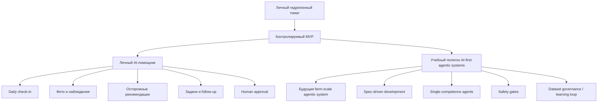

## 2. Система под капотом

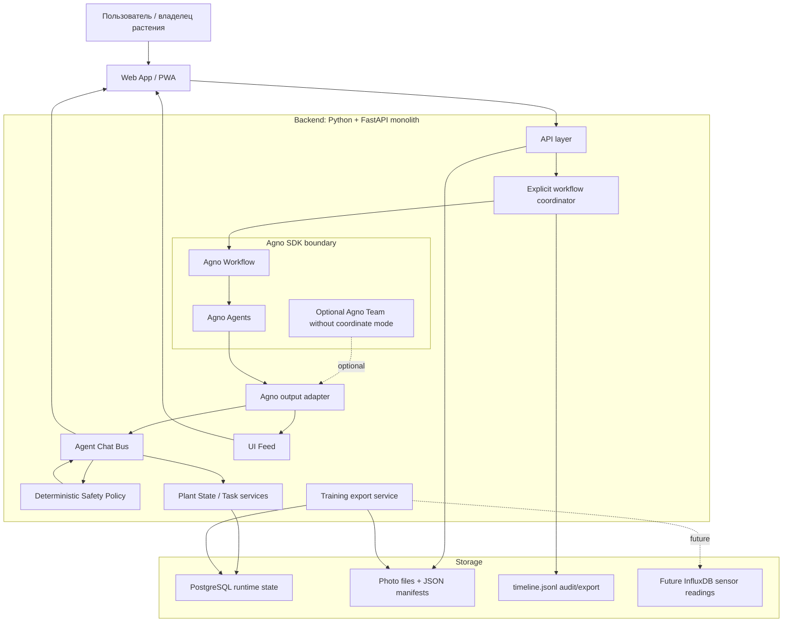

## 3. Source of truth и authority map

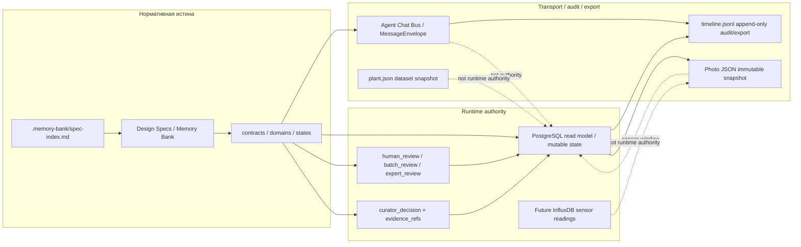

## 4. Product agents и границы компетенции

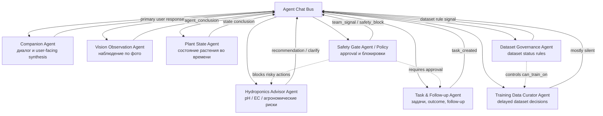

## 5. Первый daily check-in flow

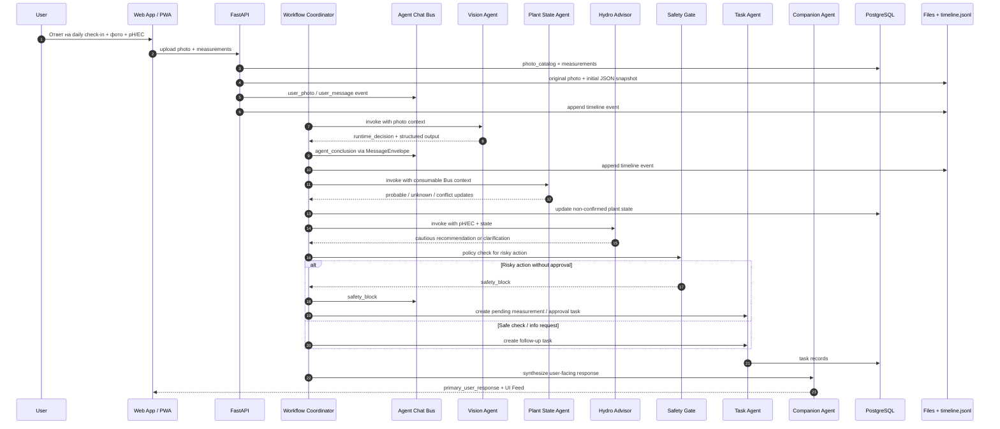

## 6. Bus vs UI Feed: context hygiene

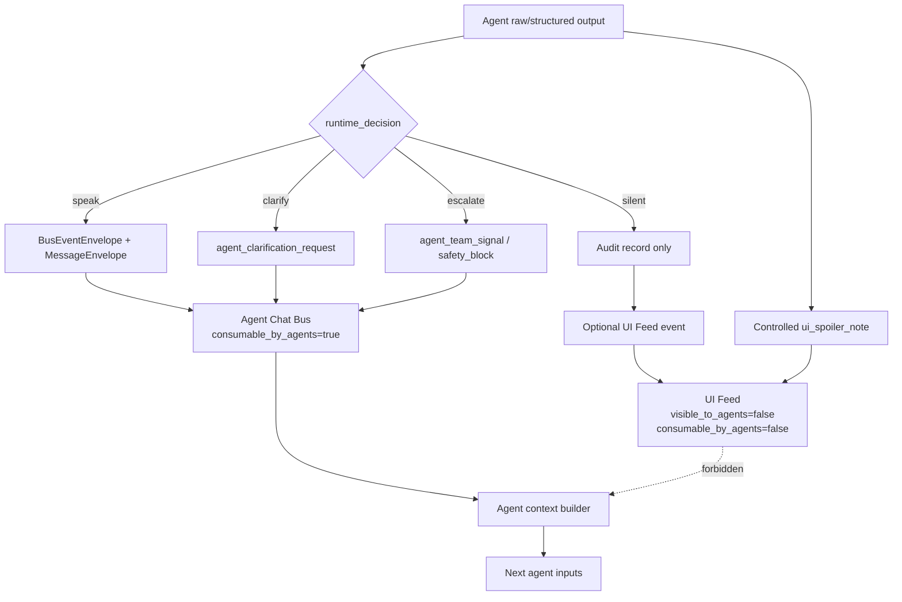

## 7. Agno boundary: SDK execution is not domain publication

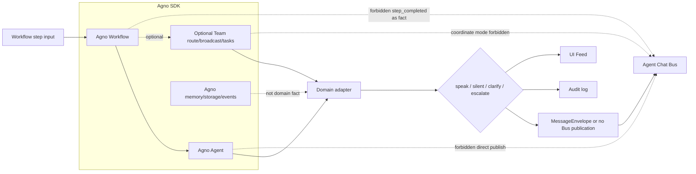

## 8. Data flow: photo, state, audit, export

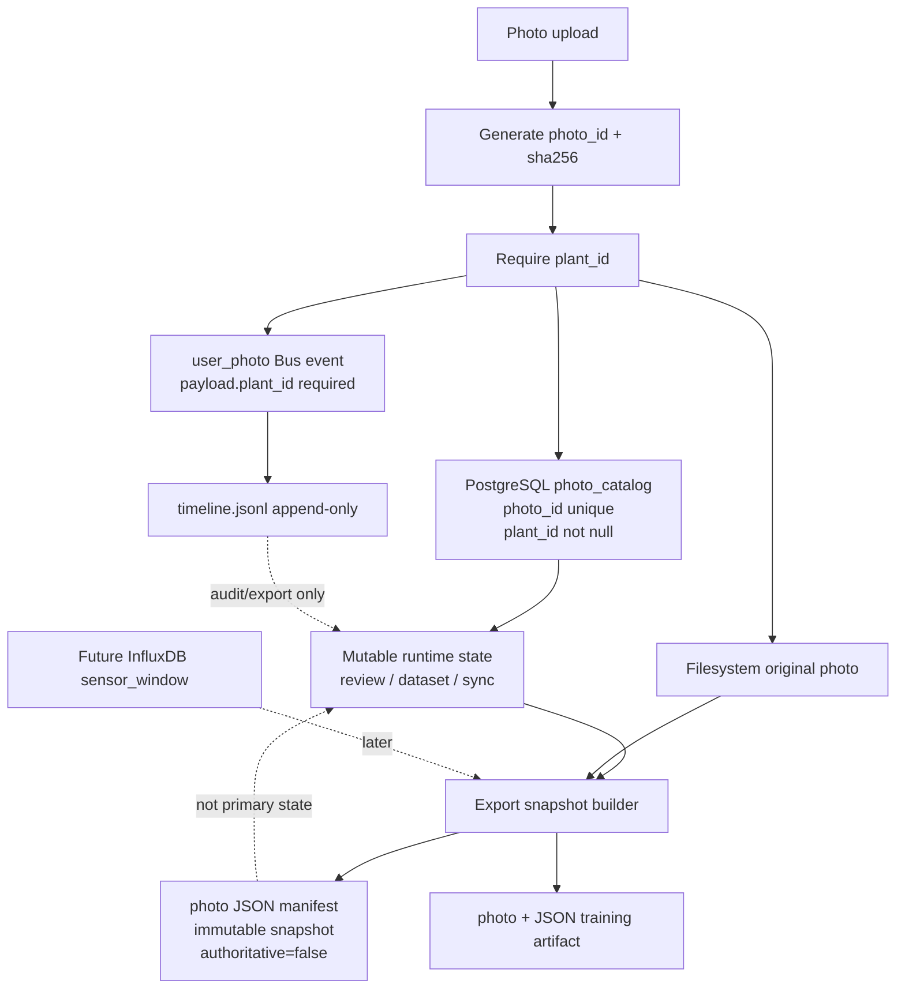

## 9. Safety approval flow

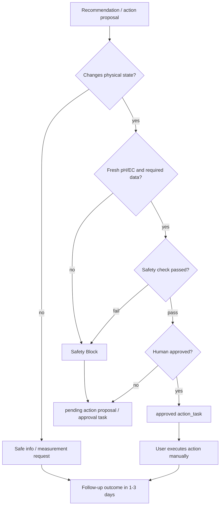

## 10. Dataset lifecycle и can_train_on

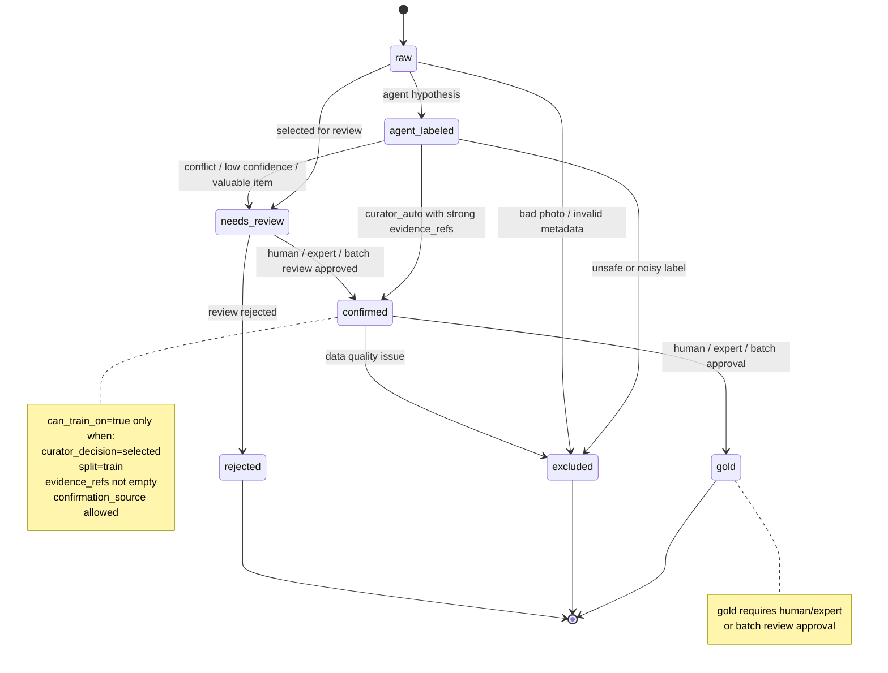

## 11. Memory Bank development workflow

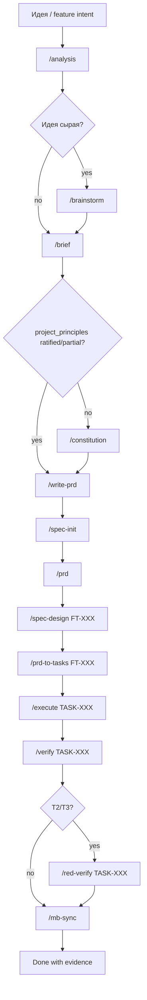

## 12. MVP scope staging

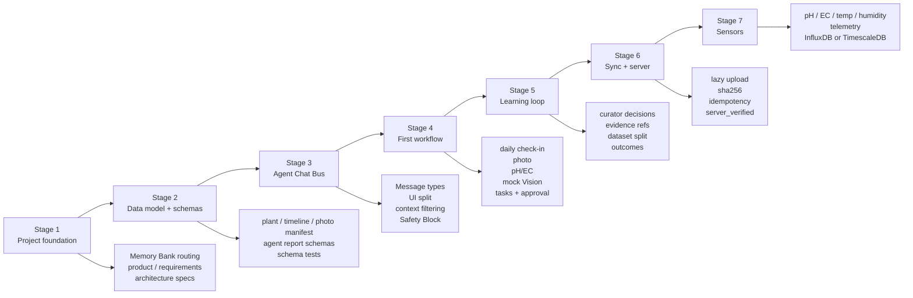

## 13. Самый важный implementation path

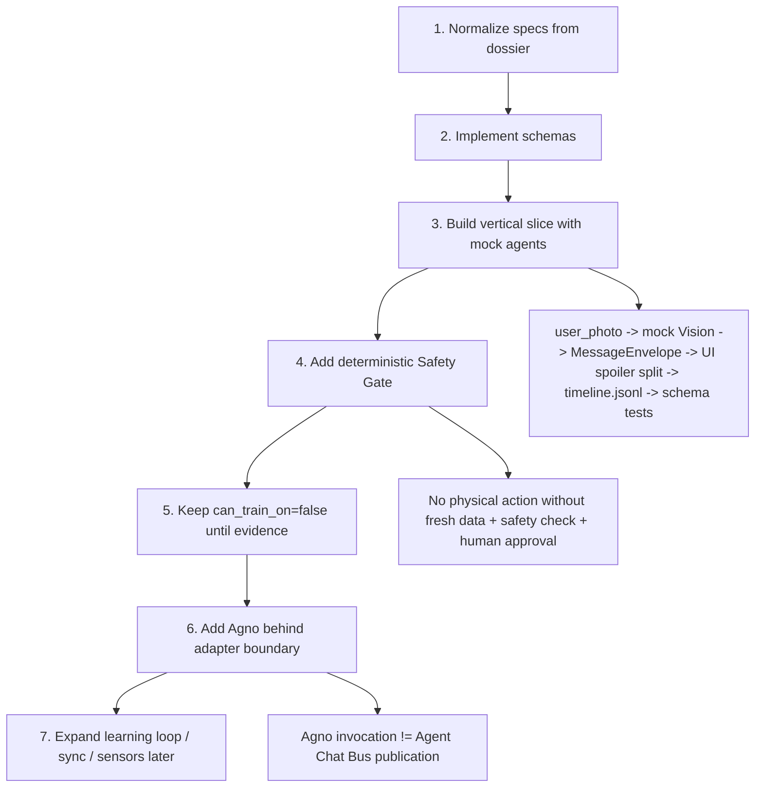

## 14. Главные рисковые зоны на одной карте

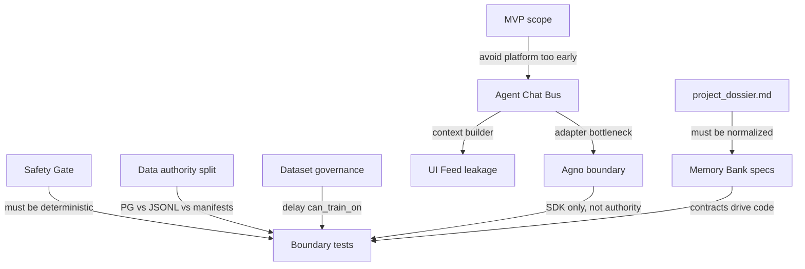
