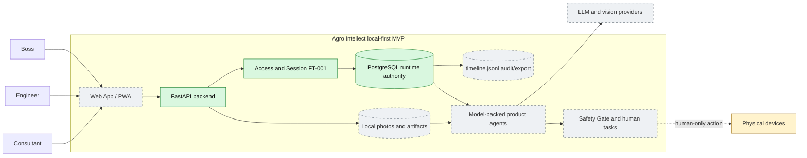

# 01. Контекст системы

Показывает текущую runnable-часть и целевое окружение Agro Intellect MVP.

Сейчас доступны backend, PostgreSQL substrate и FT-001. PWA, Plant operations,
agent runtime, artifacts и Safety Gate относятся к следующим features.

