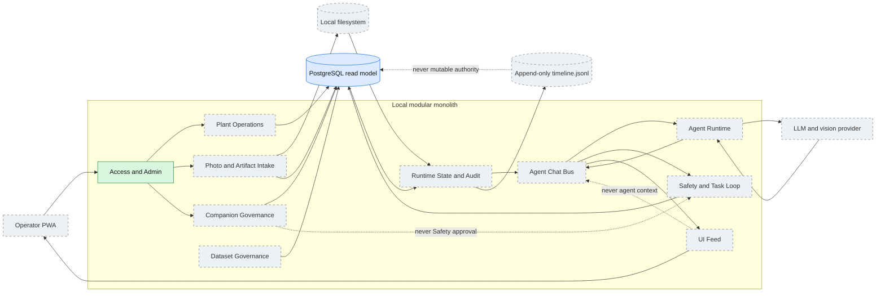

# 02. Целевая архитектура и authority boundaries

Целевой local modular monolith. Стрелки показывают основной поток данных, а не
владение каждым конкретным endpoint.

Ключевой принцип: UI Feed и timeline являются projection/audit слоями и не
могут становиться runtime authority или agent working context.

