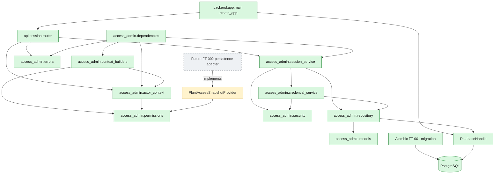

# 03. Реализованные компоненты FT-001

Фактические backend-компоненты, существующие в текущем worktree.

Protected-route dependencies и context builder реализованы как reusable seams,
но пока не смонтированы как отдельные product endpoints.

