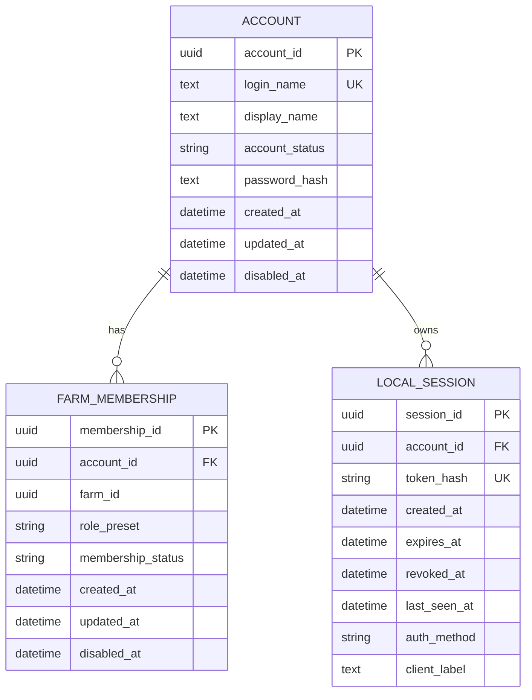

# 04. Реализованная модель данных Access and Session

Таблицы, созданные миграцией FT-001.

`farm_id` уже присутствует как identity boundary, но таблица Farm и FK появятся
в FT-002. Raw session token в базе не хранится — сохраняется только SHA-256
digest.

