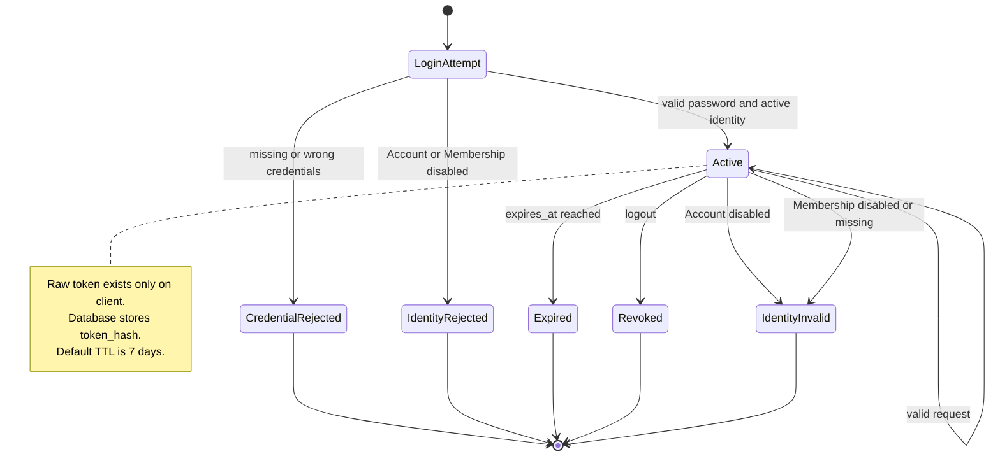

# 06. Жизненный цикл локальной сессии

```mermaid
stateDiagram-v2
    [*] --> LoginAttempt

    LoginAttempt --> CredentialRejected: missing or wrong credentials
    LoginAttempt --> IdentityRejected: Account or Membership disabled
    LoginAttempt --> Active: valid password and active identity

    Active --> Active: valid request
    Active --> Expired: expires_at reached
    Active --> Revoked: logout
    Active --> IdentityInvalid: Account disabled
    Active --> IdentityInvalid: Membership disabled or missing

    CredentialRejected --> [*]
    IdentityRejected --> [*]
    Expired --> [*]
    Revoked --> [*]
    IdentityInvalid --> [*]

    note right of Active
      Raw token exists only on client.
      Database stores token_hash.
      Default TTL is 7 days.
    end note
```

Expired и revoked sessions не восстанавливаются. Refresh-token lifecycle в MVP
отсутствует.

