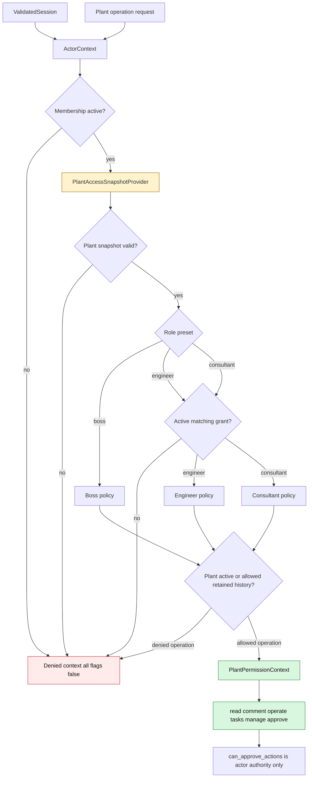

# 07. ActorContext и вычисление Plant permissions

Engineer и Consultant требуют активный PlantAccessGrant. Consultant никогда не
получает operate/task/action authority. Safety Gate остаётся отдельной будущей
границей.

