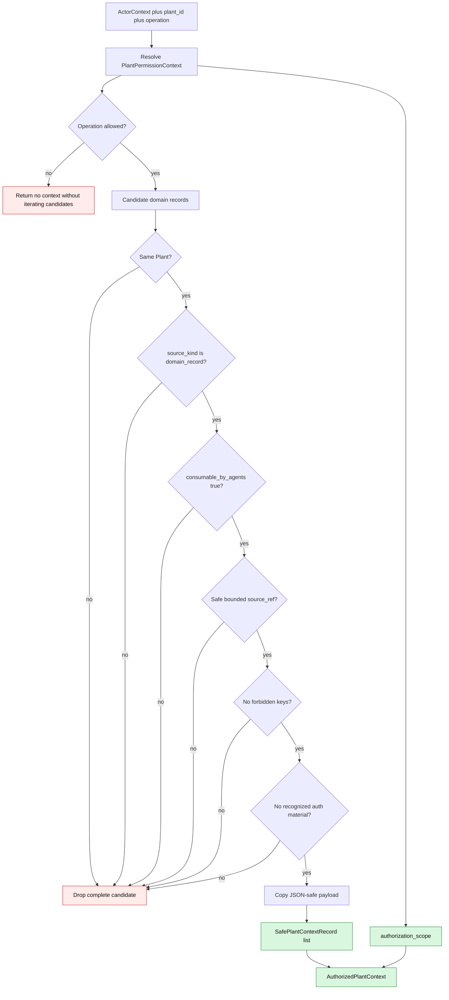

# 09. Безопасный authorization-scoped agent context

UI Feed, raw chat/reasoning/provider output, admin notices и unapproved
proposals исключаются. Текущая реализация предполагает trusted backend
candidates; typed payload contracts принадлежат будущим FT-007/FT-008.

