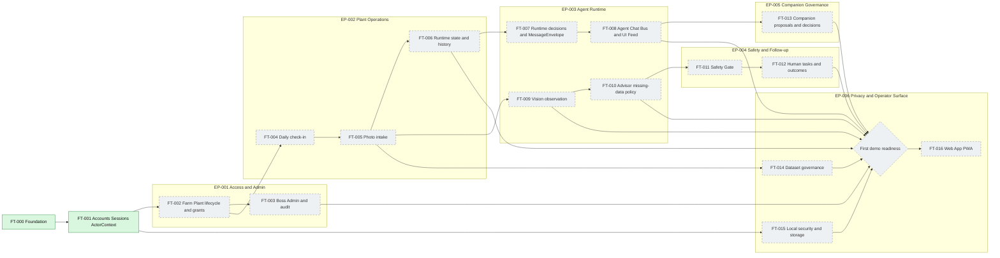

# 10. Feature roadmap MVP

Концептуальная зависимость product slices. Это не task scheduler graph.

На текущий момент реализованы Foundation и FT-001. Остальные product features
остаются в состоянии planning/specification.

