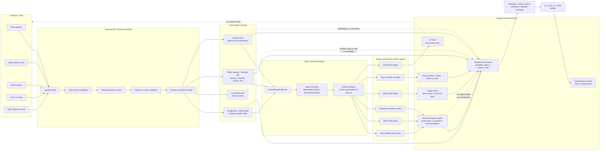

```mermaid
flowchart LR
    subgraph UI["Frontend / PWA"]
        U1["Plant selector"]
        U2["Daily check-in form"]
        U3["Photo upload"]
        U4["Chat / UI Feed"]
        U5["Task / Approval cards"]
    end

    subgraph API["Backend API / Modular Monolith"]
        A1["FastAPI route"]
        A2["ActorContext validation"]
        A3["PlantAccessGrant check"]
        A4["Pydantic schema validation"]
        A5["Domain command handler"]
    end

    subgraph Storage["Authoritative storage"]
        DB["PostgreSQL / read model<br/>runtime mutable state"]
        FS["Local filesystem<br/>photo binaries"]
        META["Photo catalog + manifest refs<br/>photo_id, sha256, source_refs"]
        TL["timeline.jsonl<br/>append-only audit/export"]
    end

    subgraph Bus["Agent runtime boundary"]
        PUB["BusPublicationService"]
        BUS["Agent Chat Bus<br/>MessageEnvelope / BusEventEnvelope"]
        CTX["Context builders<br/>только разрешённые sources"]
    end

    subgraph Agents["Single-competence product agents"]
        VISION["Vision Observation Agent"]
        STATE["Plant State Agent"]
        ADVISOR["Hydroponics Advisor Agent"]
        SAFETY["Safety Gate Agent"]
        TASKS["Task & Follow-up Agent"]
        COMP["Companion Agent"]
    end

    subgraph Out["Outputs and governance"]
        OUT1["Structured agent output<br/>observation / hypothesis / recommendation"]
        GATE["Safety result<br/>allow / block / ask more data"]
        TASK["Measurement / check / follow-up task"]
        FEED["UI Feed<br/>presentation only"]
        DG["Dataset Governance<br/>candidate_status + evidence_refs"]
        CUR["Training Data Curator<br/>future / mostly silent"]
    end

    U1 --> A1
    U2 --> A1
    U3 --> A1
    U4 --> A1
    U5 --> A1

    A1 --> A2 --> A3 --> A4 --> A5

    A5 --> DB
    A5 --> FS
    A5 --> META
    A5 --> TL

    DB --> PUB
    META --> PUB
    TL --> PUB
    PUB --> BUS
    BUS --> CTX

    CTX --> VISION
    CTX --> STATE
    CTX --> ADVISOR
    CTX --> SAFETY
    CTX --> TASKS
    CTX --> COMP

    VISION --> OUT1
    STATE --> OUT1
    ADVISOR --> OUT1
    SAFETY --> GATE
    TASKS --> TASK
    COMP --> FEED

    OUT1 --> DG
    GATE --> DG
    TASK --> DG
    DB --> DG
    META --> DG
    TL --> DG

    DG --> C1["candidate / needs_review / confirmed / rejected / excluded"]
    C1 --> C2["can_train_on = false<br/>default"]
    C2 --> CUR

    FEED -. "не source of truth" .-> UI
    TL -. "audit/export, не trainability" .-> DG
    META -. "manifest сам по себе<br/>не trainability" .-> DG
    OUT1 -. "raw agent output<br/>не trainable fact" .-> DG
```
